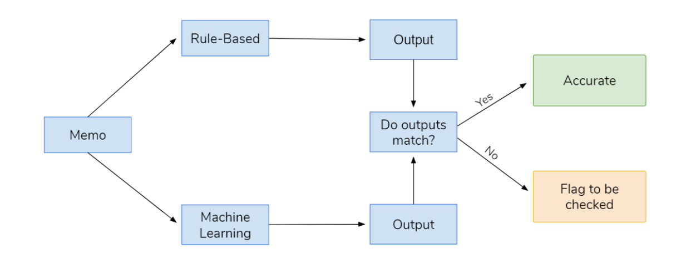

# About
Information about our Project

One-line Description: Named Entity Recognition (NER) program made with both rule-based and machine learning models. Extracts vendor name and vendor type from bank transaction memos. Focused on vendors from Bay Area, New York, and Boston. Made in collaboration with www.pilot.com.

Percentage accuracy | 89%
Trusted by product specialists | Efficient workflow (no back-checking)

Using the Gestalt pattern matching algorithm, we  compare the similarity between the outputs of both approaches to provide a confidence score.
If the similarity is larger than 60% , we provide the user with the output from the Machine Learning algorithm.
Else, we will provide the user both outputs and flag it to be double checked manually.
Thus, we increase the reliability of the automated categorization and simplify the manual categorization process with tentative recommendations.
